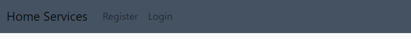
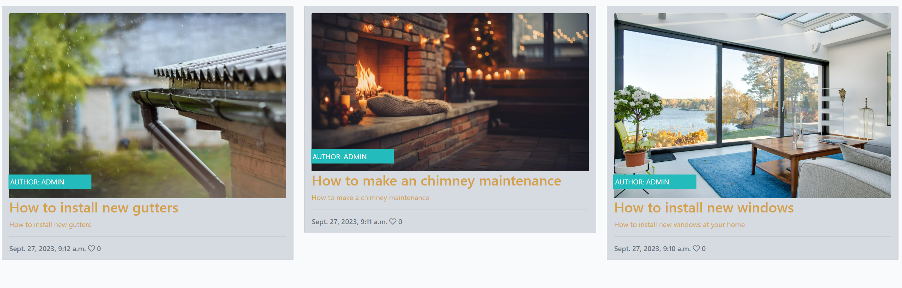
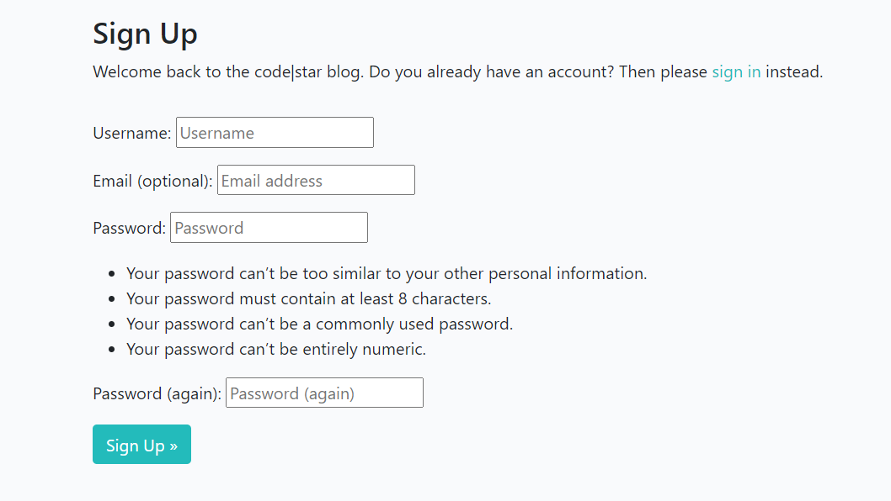
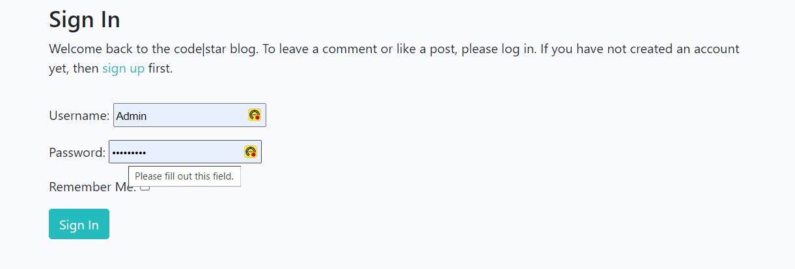

# House Services
Welcome to Home Services, your trusted source for all things related to home maintenance and improvement. Whether you're a homeowner or a renter, our website is here to provide you with valuable tips, guides, and advice to help you take care of your home.

# Features of Home Page

<h2>The Header</h2>
 
<ul>
    <li>
        
Feature at the top of the page, the naviagtion shows the Website name in the left corner:Home Services that links to the home page.

    </li>
    <li>
        
The other navigation links are to the right: Register and Login

    </li>
    <li>
        
The navigation clearly tells the user the name of the website and makes the different sections of information easy to find.

    </li>
</ul>

<h2>The Main Page</h2>
 
<ul>
    <li>
        
Shows all the posts on blog and each one has a hoover effect so the user can easily notice witch one its selecting.
  
    </li>

  
<h2>Social media Section</h2>
<ul>
    <li>
        
The has the Symbols from Facebook, Instagran and Twitter and all of them are linked  respective social media pages.
  
    </li>
    <li>
        
All the 3 Symbols have a hoover style so if the user has the arrow from the mouse pad on top of it the symbol will change color, giving the impression that the symbol is active and is functional to the user

    </li>
</ul>

 

# Features of Registration Webpage

<h2>Registration webpage</h2>
 
<ul>
    <li>
        
It has same head and footer from the Home page

    </li>
    <li>
        
It asks for the user to input his information and submit it.

    </li>
</ul>

 

# Features of Location Webpage

<h2>Login webpage</h2>
 
<ul>
    <li>
        
It has same head and footer from the Home page

    </li>
    <li>
        
Asks the user to input his information so it can create a profile

    </li>
    
</ul>

 

# Features of Sign up Webpage

<h2>Sign up webpage</h2>
 
<ul>
    <li>
        
It has same head and footer from the Home page

    </li>
    <li>
        
Simple and beautifull designed with background image that reminds the coffeehouse envirioment.

    </li>
     <li>
        
It has a sign up form that allows the user imput his first name, last name and email. The user need to fill all the text boxes in other to get the 20% discount Voucher.

    </li>
    <li>
        
The code it will not allow the user to pass through it withought the proper information on each text box.

    </li>
    <li>
        
First Name, Last Name and Email highlighted with Dancing Script font and with a shade of yellow so it calls the attention of the user.

    </li>
</ul>

 

# Testing

<ul>
    <li>
        
I tested that this page works in different browsers: Chrome, Firefox, Safari.

    </li>
    <li>
        
I confirm that this project is responsive, looks good and functions on all standard screen sizes using the devtools device toolbar.

    </li>
     <li>
        
I confirmed that naviagtion, header, home, menu, sign up, and location text are all readable and easy to understand.

    </li>
    <li>
        
I have confirmed that the form works: requires entries in every field, will only accept an email, in the email field, and the submit button works.

    </li>
</ul>

# Bugs

<ul>
    <li>
        
Background images were not covering the entire size frame digned

    </li>
    <li>
        
I discovered that the style "background-size: cover;" were missing from the style.css

    </li>
     <li>
        
Adding it solved the problem

    </li>
</ul>

# Validator Testing

<h2>HTML</h2>
<ul>
    <li>
        
No errors were returned when passing through the official W3C validator.

    </li>
</ul>
 
<h2>CSS</h2>
<ul>
    <li>
        
No errors were returned when passing through the official (jigsaw) validator.

    </li>
</ul>
 
<h2>Accessibility</h2>
<ul>
    <li>
        
I confirmed that the colors and fonts chosen are easy to read and accessible by running it through lighthouse in devtools

    </li>
</ul>

<h3>Home Webpage Accessibility Score</h3>

<h3>Menu Webpage Accessibility Score</h3>

<h3>Location Webpage Accessibility Score</h3>

<h3>Sign up Webpage Accessibility Score</h3>

 
<h2>Unfixed Bugs</h2>
<ul>
    <li>
        
No unfixed bugs

    </li>
</ul>

# Deployment
<h2>This site was deployed to GitHub pages. The steps to deploy are as follows:</h2>
<ul>
    <li>
        
In the GitHub repository, navigate to the Settings tab

    </li>
    <li>
        
From the source section drop-down menu, select the Master Branch

    </li>
    <li>
        
Once the master branch has been selected, the page provided the link to the completed website.

    </li>
</ul>
 

The live link can be found here - <a href="https://gallegodev.github.io/Portfolio-1/index.html" target="_blank" aria-label=" Visit Lola Coffeehouse webpage (Opens in another page)">Lola Coffeehouse</a>

# Credits
<h2>Content</h2>
<ul>
    <li>
        
The code to make social media, coffeehouse ethos was taken from the CI <a href="https://gallegodev.github.io/love-running/" target="_blank" aria-label=" Visit Love Running webpage (Opens in another page)">Love Running</a> Project

    </li>
</ul>
 
<h2>Media</h2>
<ul>
    <li>
        
The images used on the website was taken from <a href="https://www.freepik.com/" target="_blank" aria-label=" Visit Freepick webpage (Opens in another page)">Freepick</a>

    </li>
    <li>
        
The fonts used on the website was taken from <a href="https://fonts.google.com/" target="_blank" aria-label=" Visit Google Fonts webpage (Opens in another page)">Google Fonts</a>

    </li>
    <li>
        
The symbols used on the website was taken from <a href="https://fontawesome.com/search" target="_blank" aria-label=" Visit Font Awesome webpage (Opens in another page)">Font Awesome</a>

    </li>
</ul>
