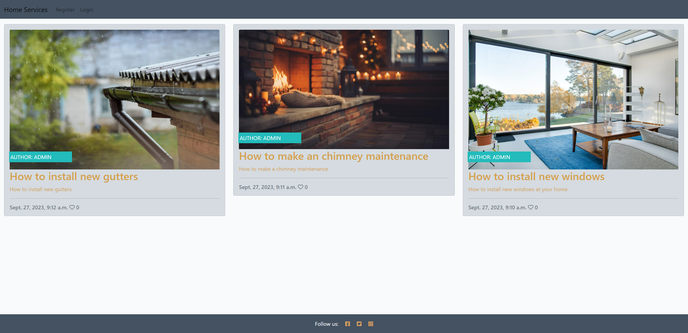

# House Services
Welcome to Home Services, your trusted source for all things related to home maintenance and improvement. Whether you're a homeowner or a renter, our website is here to provide you with valuable tips, guides, and advice to help you take care of your home.

# Features of Home Page

<h2>The Header</h2>
 
<ul>
    <li>
        
Feature at the top of the page, the naviagtion shows the coffeehouse name in the left corner:Lola Coffeehouse that links to the home page.

    </li>
    <li>
        
The other navigation links are to the right: Home, Menu, Location, Sign up.

    </li>
    <li>
        
Home, Menu, Location, has a hoover style that underlines the page the user is on.

    </li>
    <li>
        
The navigation clearly tells the user the name of the coffeehouse and website and makes the different sections of information easy to find.

    </li>
</ul>

<h2>The Welcome Section</h2>
 
<ul>
    <li>
        
Shows a lovely image from one of the tables from  coffeehouse that gives warm and welcoming feeling to the users of the website.
  
    </li>
    <li>
        
Cover on the right side of the image with the text "Made with love for you" with the font Dancing Script in a color that catch h the attention of the user.

    </li>
</ul>

 <h2>Why should you visit us? Section</h2>
 
<ul>
    <li>
        
The "Why should you visit us?" section gives details about what the coffeehouse offers to their customers.
  
    </li>
    <li>
        
The Easy Location, Friendly Envirioment and Monthly Discounts of this section have links inside of each of them that guide the users to other pages and give more information in the detail about each subject selected

    </li>
     <li>
        
The central picture in this section shows one the tables of the coffeehouse with friends having coffee together. Suggesting to the user friendly envirioment, one that the user may consider bring his friends to it. 

    </li>
</ul>

 
<h2>How do we prepare your coffee! Section</h2>
<ul>
    <li>
        
The "How do we prepare your coffee" describe to users that Lola Coffeehouse use a differente way to make coffee. One that is more unique and special.
  
    </li>
    <li>
        
The video in this section show in the details how unique is the coffee made at Lola Coffeehouse and why the coffee flavour is so special.

    </li>
</ul>

 
<h2>Social media Section</h2>
<ul>
    <li>
        
The has the Symbols from Facebook, Instagran and Twitter and all of them are linked with Lola Coffeehouse respective social media pages.
  
    </li>
    <li>
        
All the 3 Symbols have a hoover style so if the user has the arrow from the mouse pad on top of it the symbol will change color, giving the impression that the symbol is active and is functional to the user

    </li>
</ul>

 

# Features of Menu Webpage

<h2>Menu webpage</h2>
 
<ul>
    <li>
        
It has same head and footer from the Home page

    </li>
    <li>
        
Simple and beautifull designed with background image that reminds the coffeehouse envirioment, with all the menu described and centralised in the webpage.

    </li>
    <li>
        
Name of drinks and sandwiches highlighted with Dancing Script font and with a shade of yellow.

    </li>
    <li>
        
All the items on the menu are described below their names so the user can understand how each item is made

    </li>
</ul>

 

# Features of Location Webpage

<h2>Location webpage</h2>
 
<ul>
    <li>
        
It has same head and footer from the Home page

    </li>
    <li>
        
Simple and beautifull designed with background image that reminds the coffeehouse envirioment, with all the opening hour and location of the coffeehouse .

    </li>
    <li>
        
Opening hours highlighted with Dancing Script font and with a shade of yellow so it calls the attention of the user.

    </li>
    <li>
        
Google Maps Location attached to the page so the user can better understand where is the location of the Lola Coffeehouse

    </li>
    
</ul>

 

# Features of Sign up Webpage

<h2>Sign up webpage</h2>
 
<ul>
    <li>
        
It has same head and footer from the Home page

    </li>
    <li>
        
Simple and beautifull designed with background image that reminds the coffeehouse envirioment.

    </li>
     <li>
        
It has a sign up form that allows the user imput his first name, last name and email. The user need to fill all the text boxes in other to get the 20% discount Voucher.

    </li>
    <li>
        
The code it will not allow the user to pass through it withought the proper information on each text box.

    </li>
    <li>
        
First Name, Last Name and Email highlighted with Dancing Script font and with a shade of yellow so it calls the attention of the user.

    </li>
</ul>

 

# Testing

<ul>
    <li>
        
I tested that this page works in different browsers: Chrome, Firefox, Safari.

    </li>
    <li>
        
I confirm that this project is responsive, looks good and functions on all standard screen sizes using the devtools device toolbar.

    </li>
     <li>
        
I confirmed that naviagtion, header, home, menu, sign up, and location text are all readable and easy to understand.

    </li>
    <li>
        
I have confirmed that the form works: requires entries in every field, will only accept an email, in the email field, and the submit button works.

    </li>
</ul>

# Bugs

<ul>
    <li>
        
Background images were not covering the entire size frame digned

    </li>
    <li>
        
I discovered that the style "background-size: cover;" were missing from the style.css

    </li>
     <li>
        
Adding it solved the problem

    </li>
</ul>

# Validator Testing

<h2>HTML</h2>
<ul>
    <li>
        
No errors were returned when passing through the official W3C validator.

    </li>
</ul>
 
<h2>CSS</h2>
<ul>
    <li>
        
No errors were returned when passing through the official (jigsaw) validator.

    </li>
</ul>
 
<h2>Accessibility</h2>
<ul>
    <li>
        
I confirmed that the colors and fonts chosen are easy to read and accessible by running it through lighthouse in devtools

    </li>
</ul>

<h3>Home Webpage Accessibility Score</h3>

<h3>Menu Webpage Accessibility Score</h3>

<h3>Location Webpage Accessibility Score</h3>

<h3>Sign up Webpage Accessibility Score</h3>

 
<h2>Unfixed Bugs</h2>
<ul>
    <li>
        
No unfixed bugs

    </li>
</ul>

# Deployment
<h2>This site was deployed to GitHub pages. The steps to deploy are as follows:</h2>
<ul>
    <li>
        
In the GitHub repository, navigate to the Settings tab

    </li>
    <li>
        
From the source section drop-down menu, select the Master Branch

    </li>
    <li>
        
Once the master branch has been selected, the page provided the link to the completed website.

    </li>
</ul>
 

The live link can be found here - <a href="https://gallegodev.github.io/Portfolio-1/index.html" target="_blank" aria-label=" Visit Lola Coffeehouse webpage (Opens in another page)">Lola Coffeehouse</a>

# Credits
<h2>Content</h2>
<ul>
    <li>
        
The code to make social media, coffeehouse ethos was taken from the CI <a href="https://gallegodev.github.io/love-running/" target="_blank" aria-label=" Visit Love Running webpage (Opens in another page)">Love Running</a> Project

    </li>
</ul>
 
<h2>Media</h2>
<ul>
    <li>
        
The images used on the website was taken from <a href="https://www.freepik.com/" target="_blank" aria-label=" Visit Freepick webpage (Opens in another page)">Freepick</a>

    </li>
    <li>
        
The fonts used on the website was taken from <a href="https://fonts.google.com/" target="_blank" aria-label=" Visit Google Fonts webpage (Opens in another page)">Google Fonts</a>

    </li>
    <li>
        
The symbols used on the website was taken from <a href="https://fontawesome.com/search" target="_blank" aria-label=" Visit Font Awesome webpage (Opens in another page)">Font Awesome</a>

    </li>
</ul>
